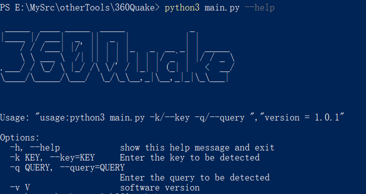

# 360Quake

360 Quake空间搜索引擎api调用

## Installation

```bash
git clone https://github.com/Ch3xd/360Quake.git
cd 360Quake
pip3 install -r requirements.txt
```


## Usage

```bash
python3 main.py -k xx-xxx-xxx -q query_str
```



运行完后会在当前目录下生成三个文件：

`url.txt  存放URL链接`

`domain.txt 存放域名信息`

`ips.txt 存放IP链接`

## 法律免责声明

未经事先双方同意，使用 360Quake 攻击目标是非法的。 360Quake 仅用于安全测试目的